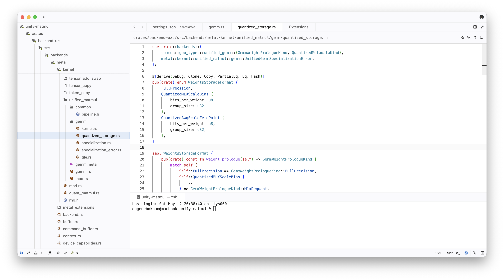
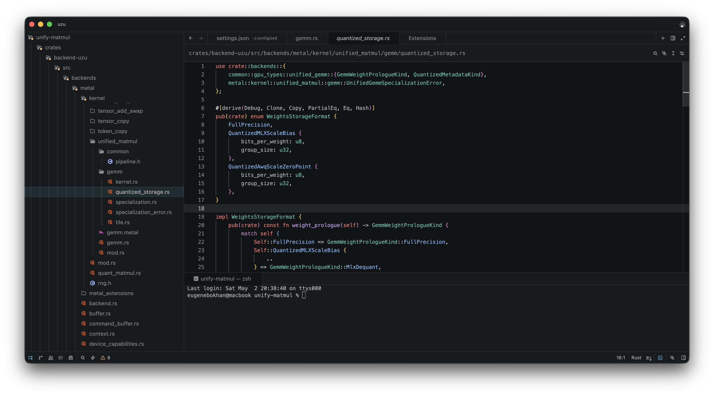

[](https://zed.dev/extensions/cursor-theme)

# VS Code 2026 Theme for Zed

VS Code 2026 inspired light and dark themes for [Zed](https://zed.dev).


Cursor inspired theme for [Zed](https://zed.dev).

## Screenshot

### Light



### Dark



## Usage

Open your Zed user settings at `~/.config/zed/settings.json`, and add:

```json
{
  "theme": {
    "mode": "system",
    "light": "VS Code Light 2026",
    "dark": "VS Code Dark 2026"
  },
  "colorize_brackets": true,
  "indent_guides": {
    "enabled": true,
    "line_width": 1,
    "active_line_width": 1,
    "coloring": "fixed",
    "background_coloring": "disabled"
  },
  "languages": {
    "Rust": {
      "semantic_tokens": "combined"
    }
  },
  "global_lsp_settings": {
    "semantic_token_rules": [
      {
        "token_type": "keyword",
        "token_modifiers": ["controlFlow"],
        "style": ["keyword.control"]
      },
      {
        "token_type": "attributeBracket"
      },
      {
        "token_type": "namespace",
        "token_modifiers": ["attribute"],
        "style": ["attribute.derive"]
      },
      {
        "token_type": "attribute",
        "token_modifiers": ["attribute"],
        "style": ["attribute.derive"]
      },
      {
        "token_type": "generic",
        "token_modifiers": ["attribute"],
        "style": ["attribute.type"]
      },
      {
        "token_type": "namespace",
        "style": ["namespace"]
      },
      {
        "token_type": "selfKeyword",
        "style": ["keyword"]
      },
      {
        "token_type": "selfTypeKeyword",
        "style": ["keyword"]
      },
      {
        "token_type": "field",
        "style": ["primary"]
      },
      {
        "token_type": "property",
        "style": ["primary"]
      },
      {
        "token_type": "enumMember",
        "token_modifiers": ["declaration"],
        "style": ["variant"]
      },
      {
        "token_type": "enumMember",
        "style": ["variant"]
      }
    ]
  }
}
```

Rust control-flow keywords, derive attributes, attribute punctuation, enum payload fields, module names, `self`, and enum member declarations/references need semantic token rules in Zed to match VS Code's rust-analyzer highlighting.

## License

MIT
